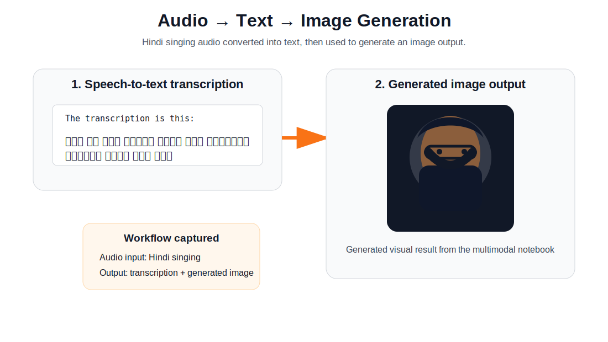

# HF Multimodal AI Lab

A hands-on Hugging Face multimodal AI lab covering **Transformers pipelines, AutoClasses, image captioning, speech-to-text, visual question answering, Diffusers, image generation, audio-to-text-to-image workflows, and Hugging Face inference endpoints**.

This repository is designed as a portfolio-ready learning lab: notebooks explain the concepts, `app/` can later become a Hugging Face Space, and `screenshots/` documents working outputs.

## Project scope

This project demonstrates practical AI workflows across text, image, and audio:

- Transformers pipeline API
- AutoTokenizer, AutoModel, and AutoClasses
- Image captioning and multimodal inference
- Speech-to-text from audio
- Text-to-image generation with Diffusers
- Audio → transcription → image generation workflow
- Hugging Face Inference API / endpoint usage
- Future Hugging Face Spaces deployment with Gradio

## Demo highlight: audio to text to image

The screenshot below shows a multimodal chain using a personal Hindi singing audio sample. The audio is first converted into Hindi text, and then the text is used to generate an image output.

> Audio input → speech transcription → generated image



## Repository structure

```text
hf-multimodal-ai-lab/
├── notebooks/
│   ├── 01_autoclasses.ipynb
│   ├── 02_pipelines.ipynb
│   ├── 03_multimodal_hf.ipynb
│   ├── 04_hf_inference_endpoint.ipynb
│   ├── 05_diffusers.ipynb
│   ├── 06_image_generation.ipynb
│   └── 07_audio_text_image.ipynb
├── app/
│   ├── app.py
│   └── requirements.txt
├── docs/
│   ├── project_overview.md
│   └── hf_spaces_plan.md
├── screenshots/
│   ├── audio-to-text-to-image-workflow.svg
│   └── .gitkeep
├── README.md
├── requirements.txt
└── .gitignore
```

## Learning modules

| Module | Focus | Notebook |
|---|---|---|
| Transformers foundations | AutoClasses and model loading | `01_autoclasses.ipynb` |
| Pipelines | High-level Hugging Face pipeline API | `02_pipelines.ipynb` |
| Multimodal inference | Image/audio/text workflows | `03_multimodal_hf.ipynb` |
| Hosted inference | Hugging Face inference endpoint usage | `04_hf_inference_endpoint.ipynb` |
| Diffusers | Generative image models | `05_diffusers.ipynb` |
| Image generation | Text-to-image experiments | `06_image_generation.ipynb` |
| Audio-text-image | Speech-to-text and generated image chaining | `07_audio_text_image.ipynb` |

## Recommended showcase strategy

Use **GitHub** as the main portfolio repository because it can hold notebooks, documentation, screenshots, and the full learning sequence.

Use **Hugging Face Spaces** later for one clean live Gradio demo. The best Space candidate is a lightweight multimodal playground with:

1. Image captioning
2. Visual question answering
3. Speech-to-text
4. Optional text-to-image if GPU resources are available

## Why this project matters

This lab shows the journey from using simple Hugging Face pipelines to building practical multimodal AI workflows. It is useful for demonstrating applied AI engineering skills across model loading, inference, generative AI, and deployment planning.

## Suggested GitHub topics

```text
huggingface, transformers, diffusers, multimodal-ai, gradio, speech-to-text, image-generation, text-to-image, ai-engineering, notebooks
```

## Next improvements

- Add screenshots for each notebook output
- Convert the most stable workflow into a Hugging Face Space
- Add a polished Gradio app under `app/`
- Add model cards and workflow diagrams
- Add lightweight CPU-friendly demos and GPU-only notes
